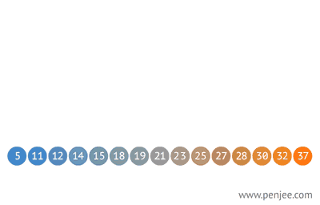

# Pesquisa Binária

A pesquisa binária é um algoritmo de busca em vetores que segue o paradigma de divisão e conquista. Ela parte do pressuposto de que o vetor está ordenado e realiza sucessivas divisões do espaço de busca comparando o elemento buscado (chave) com o elemento no meio do vetor. Se o elemento do meio do vetor for a chave, a busca termina com sucesso. Caso contrário, se o elemento do meio vier antes do elemento buscado, então a busca continua na metade posterior do vetor. E finalmente, se o elemento do meio vier depois da chave, a busca continua na metade anterior do vetor.

- Destina-se a registros onde as chaves encontram-se ordenadas;
- A busca não é iniciada no primeiro registro, e sim, no registro central da estrutura;
- Para saber se uma chave está presente na estrutura, compare a chave com o registro que está na posição do meio da tabela.



**Algoritmo**

```c
meio = (posicaoInicial + posicaoFinal) / 2;

se(numeroProcurado == meio)
    valor encontrado
senão
    se(numeroProcurado < meio)
      posicaoFinal = meio -1
    senão
      posicaoInicial = meio +1    
```

**Algoritmo implementado em C**

```c
#include <stdio.h>
#include <stdbool.h>

int main(){

    // declaração de variaveis
    int tamanho,i,numero;
    int contadorA, contadorB, num, aux, busca, inicial, ultimo, meio;
    int posicao = 0;
    bool naoEncontrado;

    // pergunta ao usuário o tamanho do vetor
    printf("Informe o tamanho do vetor: ");
    scanf("%d", &tamanho);

    // insere no vetor o tamanho informado
    int vetor[tamanho];

    // preenche o vetor com numeros aleatórios
    for(i=0; i<tamanho; i++){
        vetor[i]=rand()%100;
    }

    // ordena os valores do vetor
    for(contadorA = 0; contadorA < tamanho; contadorA++){
        for(contadorB = contadorA + 1; contadorB < tamanho; contadorB++){
            if( vetor[contadorA] > vetor[contadorB] ){
                aux = vetor[contadorB];
                vetor[contadorB] = vetor[contadorA];
                vetor[contadorA] = aux;
            }
        }
    }

    // pergunta ao usuário qual valor deseja pesquisar
    printf("Qual o valor para busca? ");
    scanf("%d",&busca);

    inicial = 0;
    ultimo = 9;
    naoEncontrado = false;

    // esse laço divide o vetor em duas partes e dependendo do valor a ser encontrado escolhe uma das partes
    while( (inicial <= ultimo) && !(naoEncontrado) ){
        meio = (inicial + ultimo) / 2;

        if(busca == vetor[meio]){
            naoEncontrado = true;
        }

        if(busca < vetor[meio]){
            ultimo = meio - 1;
        }else{
            inicial = meio + 1;
        }
    }

     printf("\nVetor ordenado\n");
    // exibe na tela o vetor ordenado
    for(contadorA = 0; contadorA < tamanho; contadorA++){
        printf(" %d -", vetor[contadorA]);
    }

    if(naoEncontrado == true){
        printf("\nDado encontado na posicao %d! ", meio);
    }else{
        printf("\nDado nao encontrado no vetor!");
    }
     return 0;
}

```